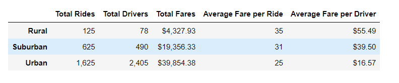

# PyBer_Analysis
Module 5 Challenge

## Ride-sharing summary DataFrame by city type

  

## Multiple-line chart of total fares for each city type

  

### Overview: 

Pyber is a ride-sharing app company valued at $2.3 billion that would like to see how data for their business differs by city type and how those differences can be used by decision-makers at PyBer. The purpose of this project was to create a summary DataFrame of the ride-sharing data by city type. Then, using Pandas and Matplotlib,  create a multiple-line graph that shows the total weekly fares for each city type. A written report that summarizes how the data differs by city type and how those differences can be used by decision-makers at PyBer is provided.

### Results: 

Based on the summary DataFrame by city type, we can see that rural areas have less drivers, but higher fares compared to urban areas with more drivers but lower fares. Total fares is the highest for urban areas. This would be consistent with the nature of the rural areas having less people with destinations further apart, compared to the urban areas with more condensed populations and short driving distances to many venues. Urban riders may also have more opportunitiers for ridesharing, since city dwellers may not have cars and many rely on public transportation. Suburban areas, as expected, fell in the middle of urban and rural areas for both total rides, fares and drivers.

The multiple-line chart of total fares for each city type reinforces what was displayed in the summary date frame, but also includes data for fares by month from January to April of 2019.  The line graph fluctuates for each with the only common pattern noted for each being an an increase for all city types in the end of February. 

### Summary:

Based on the results of the summary data frame and multiple line chart, the following recommendations can be made to the CEO to address noted disparities among the city types.

- In early January, when fares seem to be lower for suburban and urban areas, drivers can be deployed to the rural areas that seem to have more of a need at that time.
- Use peak fare times in late February to promote the brand and offer specials for the specific times frames when decreased fares are noted by specific city type.
- Find out what are the most common areas that use the service in the rural and suburban cities to set up posts near them, and advertise in those areas to increase awareness of the brand and how it can be used to serve communities that may not be familiar with ride sharing. 

